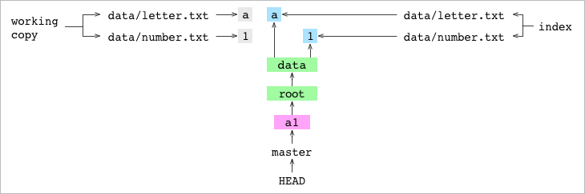

    

# Config  
## Get system, global, and (if inside a repository) local configs

    cat ~/.gitconfig  
    git config --list 

## Get current username

    git config user.name  

## Set username & email 

    git config –global user.name “[name]”                 
    git config –global user.email “[email address]”      

   

# Git has three internal state management mechanisms 
  1. Working Directory (project files & dirs)   
  2. The Staging `Index` (a list that contains every file that Git has been told to keep track of / Proposed next commit snapshot)
  3. `Commit` tree graph (series of snapshots of various branches) 

 
   

# Basic commands 

## Make current directory a Git repository 

    git init

## Stage files  

    git add filename    

  > 1. Creates a new blob file in the .git/objects/      
  > 2. Adds entry into `Index` with the hash pointing to that blob  

    git add . 
  > Add everything in current dir to `Index`      

## Commit
      
      git commit -m "Commit message"   
      git commit -a -m "Commit message"  // shortcut
  > 1. Creates `commit graph` that records the location and content of every file in the project composed of two types of entries: blobs (object) and trees (directory)   
  > 2. Creates a `commit object` with:    
  >     * hash of current `commit graph` 
  >     * hash of prev `commit graph`
  >     * author
  >     * commit message
  > 3. Points the current branch pointer (`HEAD`) to the new commit object.  
  >    `HEAD` --> `master` --> `commit object`  
  >    * `master` is a pointer that points to `master` branch's last commit object. 
  >    * `master` is the name given to the default branch in a repo
  >    * `HEAD` is the pointer to current branch. `HEAD` pointer can be moved to different branches, tags, or commits when using git checkout  
  >    *  Git has different ways to refer to commits such as,  
          an ID: `1a410e`   
          a branch name: `master`  
          a tag: `v1.0`   
          symbolic reference: `HEAD`, `HEAD~`, `HEAD~4` 
  >
  >   

## Create a Branch

    git branch feature-branch  
  > * creates a new file at .git/refs/heads/feature-branch                   
  > * Creates new pointer named `feature-branch` & points it to where `HEAD` is pointing currently i.e `master`
  > * `HEAD` is still pointing to `master` because we haven't checked-out the new branch yet
  
## Checkout a Branch

    git checkout feature-branch            
  > * Points `HEAD` to `feature-branch`
  > * When you checkout a branch, it changes `HEAD` to point to the new branch ref, populates your `index` with the snapshot of that `commit`, then copies the contents of the `index` into your `working directory`  
  >
  > 

## Create & Checkout a Branch (Shortcut)

    git checkout -b feature-branch    

## Commit changes to `feature-branch`

    git commit -a -m "made changes"    
  > `feature-branch` branch has moved forward but master branch still points to commit done on branch creation.

## Go back to master branch

      git checkout master             

  > * `HEAD` points back to the `master` branch
  > * Files content in `working dir` reverted back to `master` 

## `Master` branch has moved forward 

    git commit -a -m "made more changes"  
  > * While you were working on `feature-branch` parallelly `master` branch also moved ahead due to other people's work
  > * Now your project history has diverged
  >
  > 

## Merge an ancestor branch into current branch

    git checkout feature-branch
    git merge master
    Already up-to-date.
  
  > * Combines the specified branch’s history into the 
current branch  
  > * In a merge, if the **giver** commit (`master`) is an ancestor of the **receiver** commit (`feature-branch`), Git will do nothing. 

## Merge a descendent branch into current branch

    git checkout master
    git merge feature-branch
    Fast-forward

  > * If the **giver** commit (`feature-branch`) is a descendent of the **receiver** commit (`master`), Git will just apply sequence of commits to working dir.

## Merge two commits from different lineages

    git merge master -m 'b11'

  > * Git finds the most recent ancestor shared by both lineages. This is the `base-commit`.
  > * Git generates a diff that combines the changes made to the `base-commit` by the `receiver-commit` and the `giver-commit`. It's a list of file paths that point to a change: add, remove, modify or conflict.
  > * A conflict occurs when content is different in all three of `base, receiver & giver commits`. User can decide what to keep by staging changes & commit. That ends the merge.  
  > * Can also use `git merge --abort` if merge fails
  >
  >   

## Link a repository to another repository

    cp -R alpha bravo
    cd alpha
    git remote add bravo ../bravo

  > * The user copies the contents of repository `alpha` to a different location
  > * They set up `bravo` as a remote repository on `alpha`. This adds some lines to the file at alpha/.git/config,
  >   
  > * [remote "bravo"]   
  >   url = ./bravo/

## Clone a repository

    cd ..
    git clone alpha charlie

  >  * Cloning to `charlie` has similar results to the copy repository shown above
  > * Git creates a new directory called `charlie`. It inits `charlie` as a Git repo, adds `alpha` as a remote & fetches it 
  > * [remote "origin"]  
  >   url = ../alpha

## Fetch from a remote repository branch

    git fetch bravo master
  
  > * Downloads objects and refs from another repository
  > * For example, commits were made to `bravo` repository's `master` branch
  > * Git gets the hash of the commit that `master` is pointing at on `bravo`
  > * Git sets remote branch ref `bravo/master` to `bravo`'s `master` last commit
  >
  >   

## Merge remote branch into local one

    git merge bravo/master

## Pull = Fetch + Merge

    git pull bravo master

## Push changes to a remote Branch   
    
    git remote add charlie ../charlie
    make changes into alpha repo's master branch & commit.....
    git push charlie master
  
  > * User makes changes to `master` branch of `alpha` repo and commits 
  > * Then pushes `master` to remote repo `charlie`
  > * All the objects required for the commit are copied to `charlie`
  > * If someone is working on remote branch `master` & it's checkout, `git push` will fail
  > * If user wants a repository that they can push to whenever they want, they want a central repository that they can push to and pull from, but that **no one commits to directly**. They want a `bare-repository` . 
  > *     git clone alpha delta --bare
  >       git remote add delta ../delta
  >       Make changes into alpha / master & commit......
  >       git push delta master

  

# Other commands

## Status 

    git status

  > * Displays the state of the working directory and the staging area. It lets you see which changes have been staged, which haven’t, and which files aren’t being tracked by Git. 
  > * Use this command to check the state of your repository before committing changes
  > * Status output does not show you any information regarding the committed project history. For this, you need to use `git log`

 

## View coloured graph of all commits
    
    git log --oneline --decorate --graph --all

  > * Displays committed snapshots. It lets you list the project history, filter it, and search for specific changes
  
    git log -p
  
  > * Display the patch representing each commit. This shows the full diff of each commit, which is the most detailed view you can have of your project history

 

## Difference between two branches / file versions
    
    git diff [first-branch]...[second-branch]  
  >

    git diff     
  > Show file differences between `index` & `working dir`

    git diff –-staged
  > Show file differences between `index` & `HEAD` i.e last commit on the branch

    git diff --name-only HEAD HEAD~      
  > Show modified files between two commits 

    git diff HEAD HEAD~ somedir/somefile.ext
  > Show difference made in a file between two commits

 

## Show commit details

    git show [commit]
  
  > Show metadata and content changes of the specified `commit`

 

## Delete a file 

    git rm [file]

  > Deletes a file from your working directory and stages the deletion

 

## Undo working directory / staged changes

    git restore filename

  > Restores a file to match the version in the index i.e undo working dir changes.

    git restore --source=HEAD --staged --worktree hello.c

  > * Restore files in the working tree from either the index or another commit by specifying `--source`
  > * The command can be used to restore the content in the index with `--staged`, or restore both the working tree and the index with `--staged --worktree`.    

 

## Moving back to a previous state

    git reset

  > * Modifies the state of the three trees.
  > * The command line arguments `--soft`, `--mixed`, and `--hard` direct how to modify Commit history, Staging Index, and Working Directory trees
  > * By default `--mixed` mode is choosen, `HEAD` is the default commit
  >
  >   
  > * Make sure that you’re using `git reset` on a local experiment that went wrong—not on published changes. If you need to fix a public commit, the `git revert` command was designed specifically for this purpose. 

    git reset --soft HEAD~

  > 

    git reset --mixed HEAD~

  >   

    git reset --hard HEAD~

  >  

    git reset filename

  > This has the practical effect of unstaging the file

 

## Undoing changes without changing history

    git revert HEAD

  > * Instead of removing the commit from the project history, it figures out how to invert the changes introduced by the commit and appends a new commit with the resulting inverse content. 
  > * Revert will create a new commit which will open up the configured system editor prompting for a new commit message. Once a commit message has been entered and saved Git will resume operation.

## Rewriting history

    git rebase master

  > * Rebasing is the process of moving or combining a sequence of commits to a new base commit. 
  > * It's used in integrating changes from `master` before merging the branch with `master`. Rebasing is like saying, “I want to base my changes on what everybody has already done.”
  > * Git `rebase` in standard mode will automatically take the commits in your current working branch and apply them to the head of the passed branch.
  > * From a content perspective, rebasing is changing the base of your branch from one commit to another making it appear as if you'd created your branch from a different commit. Internally, Git accomplishes this by creating new commits and applying them to the specified base.
  > 

    git rebase --interactive master

  > Opens an editor where you can enter commands (described below) for each commit to be rebased. These commands determine how individual commits will be transferred to the new base. 

  

# Tips
1. A safe way to merge is to create a temporary branch on `master` called `merge-attemp` & merge `feature-branch` onto it to check merge conflicts that may arise. You can delete the temporary branch if too many conflicts are found & try a merge later.

  

# Workflow

## Single Developer: Local repository with a remote repository

    git init
    git add .
    git status
    git commit -m "First commit"
    git remote add origin <REMOTE_URL>
    git remote -v
    git push origin master
    Make some changes to the files........
    git status
    git commit -am "Modified"
    git push origin master

## Multi Developer: Integration-Manager Workflow    

    1. The project maintainer pushes to their public repository.

    2. A contributor clones that repository and makes changes.

    3. The contributor pushes to their own public copy.

    4. The contributor sends the maintainer an email asking them to pull changes.

    5. The maintainer adds the contributor’s repository as a remote and merges locally.

    6. The maintainer pushes merged changes to the main repository.

## Github workflow
  Ref: https://git-scm.com/book/en/v2/GitHub-Contributing-to-a-Project

    1. Fork the project.

    2. Create a topic branch from master.

    3. Make some commits to improve the project.

    4. Push this branch to your GitHub project.

    5. Open a Pull Request on GitHub.

    6. Discuss, and optionally continue committing.

    7. The project owner merges or closes the Pull Request.

    8. Sync the updated master back to your fork.

 

# References
https://codewords.recurse.com/issues/two/git-from-the-inside-out  
https://git-scm.com/book/en/v2/  
https://git-scm.com/book/en/v2/Git-Tools-Reset-DemystifiedGetting-Started-About-Version-Control  
https://training.github.com/downloads/github-git-cheat-sheet.pdf  
http://rogerdudler.github.io/git-guide/  

